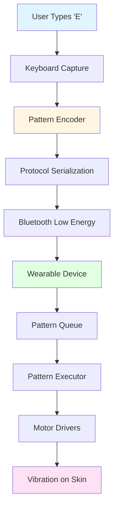
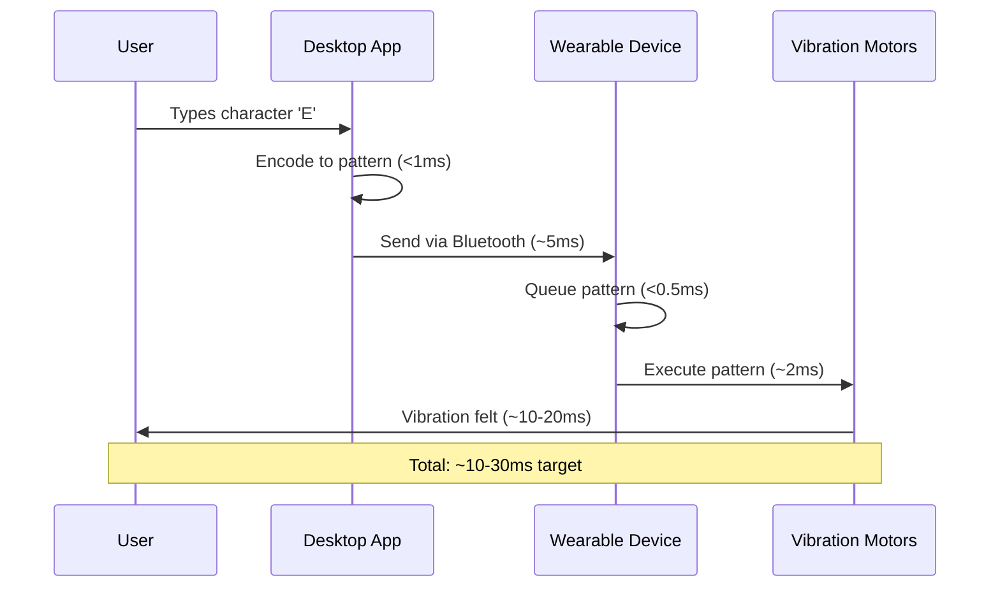
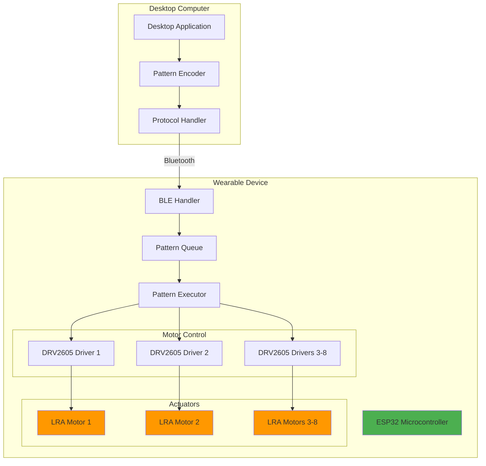
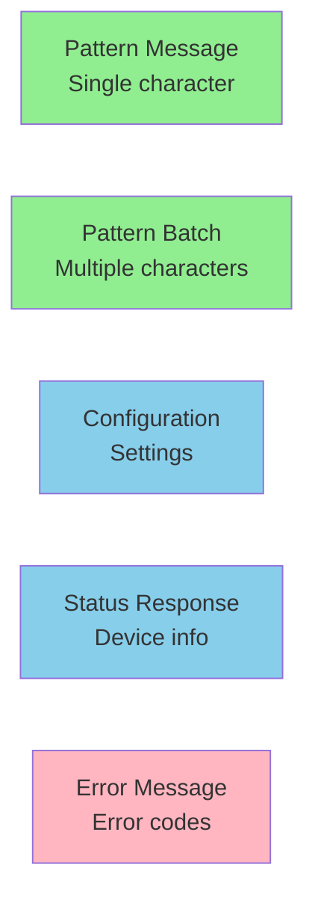
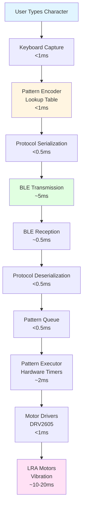

# Teletypathy

**A tactile communication system that translates keystrokes and text into physical vibration patterns you can feel on your skin.**

> **⚠️ Note: This is a proof-of-concept repository and is not currently functional.** The codebase represents research, design, and early implementation work. Hardware prototyping, firmware development, and full system integration are still in progress.

---

## What is Teletypathy?

Teletypathy enables real-time tactile communication by converting keyboard input and text messages into vibration patterns delivered through wearable hardware. Imagine feeling each letter you type as a unique vibration pattern on your forearm—that's Teletypathy.

### The Vision

Type on your keyboard, and instantly feel each character as a distinct vibration pattern. Over time, your brain learns to recognize these patterns, creating a new sensory channel for communication—like learning a new language through touch.

### The End Goal

The ultimate goal of Teletypathy is to enable **complete message reception and understanding through touch alone**—without any visual or audio signals. Once you've learned the tactile patterns, you can:

- **Receive messages** while your eyes are busy (driving, reading, working)
- **Communicate silently** in environments where sound isn't appropriate
- **Access information** without visual displays or audio alerts
- **Create a new sensory channel** that works independently of sight and hearing

This opens up possibilities for accessibility, multitasking, and entirely new forms of human-computer interaction where touch becomes a primary communication medium.

---

## How It Works

### System Overview



### The Complete Flow



### Encoding System: Mixed Character/Phoneme Approach

Teletypathy uses an **8-bit encoding system with mode indicator** that enables seamless mixing of character and phoneme patterns:

#### Architecture

```
8-Actuator System:
┌─────────────────────────────────────────┐
│ Actuator 0-6: DATA (7 bits = 128 pat.) │
│ Actuator 7:   MODE INDICATOR            │
│   - OFF (0): Character encoding mode     │
│   - ON  (1): Phoneme encoding mode      │
└─────────────────────────────────────────┘

Pattern Space:
- Patterns 0-127:   Character/Word mode (Actuator 7 = OFF)
- Patterns 128-255: Phoneme mode (Actuator 7 = ON)
- Total: 256 patterns (perfect 8-bit fit)
```

#### Encoding Modes

**1. Character Mode (Actuator 7 = OFF)**
- Direct character-to-pattern mapping
- Patterns 0-127 available
- 80ms per character (uniform speed)
- Best for: Technical text, proper nouns, exact spelling

**2. Phoneme Mode (Actuator 7 = ON)**
- Text → phonemes → patterns
- Patterns 128-255 available
- 80ms per phoneme (uniform speed)
- Best for: General text, natural speech patterns
- **8.9% faster** than character mode (fewer patterns)

**3. Hybrid Mode (Automatic)**
- Uses phonemes for common words
- Falls back to characters for proper nouns/technical terms
- Seamless mode switching per pattern
- Best for: Mixed content

#### Performance

| Encoding Method | Speed | Improvement | Best For |
|----------------|-------|-------------|----------|
| **8-Bit Phoneme** | **13.7 cps** | **+8.9%** | **General text** |
| Single-byte Character | 12.5 cps | Baseline | Technical text |
| Hybrid (Phoneme+Char) | 12.8 cps | +2.6% | Mixed content |

**Example**: 7,014-character article
- Character encoding: 9.35 minutes
- **Phoneme encoding: 8.36 minutes** (0.99 min saved, 10.6% faster)

#### Pattern Examples

**Character 'A' (Pattern 65):**
```
Binary: 01000001
- Actuator 7: OFF (character mode)
- Actuator 0: ON (character ID = 65)
- Duration: 80ms
```

**Phoneme /h/ (Pattern 128):**
```
Binary: 10000000
- Actuator 7: ON (phoneme mode)
- Actuators 0-6: OFF (phoneme ID = 0)
- Duration: 80ms
```

Both modes use **80ms patterns** for consistent speed and seamless switching.

### Hardware Architecture



---

## Key Features

- **Ultra-Low Latency**: Target <10ms from keystroke to vibration
- **Real-Time Communication**: Instant tactile feedback as you type
- **8-Actuator System**: Rich spatial patterns with mode indicator
- **Mixed Encoding**: Seamless character/phoneme mode switching
- **Optimized Speed**: 8.9% faster with phoneme encoding (13.7 cps)
- **Frequency-Optimized**: Common patterns use simpler bit patterns
- **Learnable**: Designed for muscle memory development over time
- **Wireless**: Bluetooth Low Energy for untethered operation
- **Battery-Powered**: 6-10 hours of active use

---

## Project Status

**Current Phase**: Phase 1 - Research & Approach Design

- ✅ Encoding system designed
- ✅ Protocol specification complete
- ✅ Hardware platform selected (ESP32)
- ✅ Pattern library defined
- 🔄 Core library implementation in progress
- ⏳ Desktop application (planned)
- ⏳ Firmware development (planned)
- ⏳ Hardware prototyping (planned)

---

## Repository Structure

```
teletypathy/
├── docs/               # Comprehensive documentation
│   ├── research/      # Research findings
│   ├── design/        # System design documents
│   ├── hardware/      # Hardware specifications
│   ├── architecture/  # Architecture diagrams
│   └── api/           # API documentation
├── src/               # Source code
│   ├── core/          # Core libraries (encoding, protocol)
│   └── desktop/       # Desktop application
├── firmware/          # Embedded firmware (ESP32)
├── tests/             # Test suites
└── examples/          # Usage examples
```

---

## Encoding Modes

Teletypathy supports multiple encoding modes optimized for different use cases:

### 1. Character Encoding (Single-Byte)

**How it works:**
- Each character → 8-bit pattern (80ms)
- Direct ASCII mapping
- Mode indicator: Actuator 7 = OFF

**Best for:**
- Technical text, code, URLs
- Proper nouns and names
- When exact spelling matters
- Learning character patterns

**Performance:** 12.5 characters/second

### 2. Phoneme Encoding (8-Bit) ⭐ **Recommended**

**How it works:**
- Text → phonemes → 8-bit patterns (80ms each)
- Mode indicator: Actuator 7 = ON
- Fewer patterns than characters (6.7-10.6% compression)

**Best for:**
- General text and articles
- Narrative content
- Natural speech patterns
- Maximum speed

**Performance:** 13.7 characters/second (**8.9% faster**)

**Example:**
- "hello" = 5 characters → 4 phonemes (/h/ /ɛ/ /l/ /oʊ/)
- Character encoding: 5 × 80ms = 400ms
- Phoneme encoding: 4 × 80ms = 320ms
- **20% faster for this word**

### 3. Hybrid Mode (Automatic)

**How it works:**
- Common words → phonemes (faster)
- Proper nouns/technical terms → characters (exact spelling)
- Automatic mode switching per pattern

**Best for:**
- Mixed content (articles with names/technical terms)
- Adaptive encoding
- Best of both worlds

**Performance:** 12.8 characters/second

### Mode Indicator Architecture

The mode indicator (Actuator 7) enables seamless mixing:

```
Pattern Format:
[Mode Bit] [Data Bits 0-6]

Character 'A' (65):  01000001 (Actuator 7 = OFF)
Phoneme /h/ (128):   10000000 (Actuator 7 = ON)

Both use 80ms patterns - unified speed!
```

**Benefits:**
- ✅ No mode switching overhead
- ✅ Can mix within same message
- ✅ Clear mode indication (no ambiguity)
- ✅ Perfect capacity fit (256 patterns)

---

## Technical Deep Dive

### System Architecture

The Teletypathy system consists of three main layers:

#### 1. Desktop Application Layer

- **Input Modules**: Keyboard capture, text processing, device management
- **Core Library**: Pattern encoding, protocol serialization
- **Communication**: BLE client for wireless transmission

#### 2. Communication Layer

- **Protocol**: Bluetooth Low Energy (BLE) with optimized connection parameters
- **Message Format**: Binary protocol with minimal overhead
- **Latency Optimization**: 7.5ms connection interval, Write Without Response

#### 3. Hardware Layer

- **Microcontroller**: ESP32-WROOM-32 (dual-core, 240MHz, BLE)
- **Motor Drivers**: 8× DRV2605 haptic driver ICs (I2C interface)
- **Actuators**: 8× LRA (Linear Resonant Actuator) motors
- **Power**: 2000mAh Li-ion battery (~6-10 hours active use)

### Encoding System

#### Design Principles

1. **8-Bit Encoding**: All patterns use 8-bit values (256 total patterns)
2. **Mode Indicator**: Actuator 7 indicates encoding type (character vs. phoneme)
3. **Unified Speed**: Both modes use 80ms patterns for consistency
4. **Frequency Optimization**: Common patterns use simpler bit patterns
5. **Seamless Switching**: Can mix character and phoneme patterns in same message
6. **Learnability**: Patterns designed for muscle memory development

#### Pattern Structure

**8-Bit Pattern Format:**
- **Actuator 7**: Mode indicator (OFF = character, ON = phoneme)
- **Actuators 0-6**: Data bits (7 bits = 128 patterns per mode)
- **Duration**: 80ms (uniform for all patterns)
- **Activation**: All actuators simultaneous (spatial encoding)

#### Pattern Space Allocation

- **Character Mode** (Patterns 0-127):
  - Basic characters: ~78 patterns (letters, numbers, punctuation)
  - Top 150 words: 150 patterns (optional word-level encoding)
  - Remaining: 28 patterns for expansion

- **Phoneme Mode** (Patterns 128-255):
  - English phonemes: 40 patterns
  - Remaining: 88 patterns for expansion (stress markers, other languages)

#### Encoding Modes

**Character Encoding:**
- Direct ASCII-to-pattern mapping
- Preserves exact spelling
- Best for: Technical text, proper nouns, URLs, code

**Phoneme Encoding:**
- Text → phonemes → patterns (G2P conversion)
- Fewer patterns (6.7-10.6% compression)
- **8.9% faster** than character encoding
- Best for: General text, narrative content, natural speech

**Hybrid Mode:**
- Automatic selection: phonemes for common words, characters for proper nouns
- Seamless mode switching per pattern
- Best for: Mixed content

#### Performance Comparison

**For 7,014-character article:**
- Single-byte character: 9.35 minutes (12.5 cps)
- **8-bit phoneme: 8.36 minutes (14.0 cps)** ⭐ Fastest
- Character + Top 150 words: 8.86 minutes (13.2 cps)
- Hybrid: 9.04 minutes (12.9 cps)

**Key Insight**: Phoneme encoding provides **8.9% average speed improvement** by reducing pattern count while maintaining full legibility.

### Communication Protocol

#### Message Types



#### Message Format

```
[Header: 2 bytes] [Payload: variable] [Checksum: 1 byte]

Header:
  - Message type (4 bits)
  - Flags (4 bits)
  - Payload length (8 bits)
```

#### BLE Service

- **Service UUID**: `0000FF00-0000-1000-8000-00805F9B34FB`
- **Pattern Characteristic**: Write, Write Without Response (low latency)
- **Status Characteristic**: Notify (battery, errors)
- **Config Characteristic**: Read/Write (settings)

### Hardware Specifications

#### ESP32 Microcontroller

- **CPU**: Dual-core Xtensa LX6, 240MHz
- **RAM**: 520KB SRAM
- **Flash**: 4MB (typical)
- **Wireless**: WiFi + Bluetooth 4.2 (BLE)
- **GPIO**: 34 pins
- **Power**: 80-150mA active (BLE), <1mA deep sleep

#### DRV2605 Motor Drivers

- **Quantity**: 8 drivers (one per motor)
- **Interface**: I2C (shared bus)
- **Features**: 
  - Automatic resonance tracking (critical for LRA)
  - Built-in haptic effect library
  - Real-time playback mode
  - Overcurrent/overvoltage protection

#### LRA Motors

- **Quantity**: 8 actuators
- **Size**: 3-10mm diameter
- **Resonance**: ~175 Hz (typical)
- **Response Time**: 10-20ms
- **Power**: 30-80mA per motor
- **Layout**: Linear array, 40-50mm spacing

### Performance Targets

| Metric | Target | Status |
|--------|--------|--------|
| End-to-end latency | <10ms | ⏳ In progress |
| Pattern generation | <1ms | ✅ Achieved |
| BLE transmission | <5ms | ⚠️ Needs optimization |
| Pattern execution | <2ms | ⏳ In progress |
| Battery life | 6-10 hours | ⏳ To be validated |
| Throughput | 10+ patterns/sec | ⏳ To be validated |

### Latency Breakdown

The following diagram shows the sequential pipeline from keystroke to vibration, with each stage's duration and cumulative timing:

```mermaid
flowchart LR
    Start([Keystroke]) --> IC[Input Capture<br/>~1ms]
    IC --> PG[Pattern Generation<br/>~1ms<br/>Total: ~2ms]
    PG --> PS[Protocol Serialization<br/>~0.5ms<br/>Total: ~2.5ms]
    PS --> TX[BLE Transmission<br/>~5ms<br/>Total: ~7.5ms]
    TX --> RX[BLE Reception<br/>~0.5ms<br/>Total: ~8ms]
    RX --> PD[Protocol Deserialization<br/>~0.5ms<br/>Total: ~8.5ms]
    PD --> PQ[Pattern Queue<br/>~0.5ms<br/>Total: ~9ms]
    PQ --> PE[Pattern Execution<br/>~2ms<br/>Total: ~11ms]
    PE --> MR[Motor Activation<br/>~1ms<br/>Total: ~12ms]
    MR --> Vibration[Physical Vibration<br/>+10-20ms<br/>Perceived: ~22-32ms]
    
    style Start fill:#e1f5ff
    style IC fill:#e1f5ff
    style PG fill:#e1f5ff
    style PS fill:#e1f5ff
    style TX fill:#fff5e1
    style RX fill:#fff5e1
    style PD fill:#e1ffe1
    style PQ fill:#e1ffe1
    style PE fill:#e1ffe1
    style MR fill:#ffe1f5
    style Vibration fill:#ffcccc
```



**Target Total**: <10ms (excluding motor physical response)  
**Current Estimate**: 20-40ms (including motor response, needs optimization)

#### Target Latency (Optimized)

| Stage | Target | Cumulative Time |
|-------|--------|----------------|
| Input capture | <1ms | ~1ms |
| Pattern generation | <1ms | ~2ms |
| Protocol serialization | <0.5ms | ~2.5ms |
| BLE transmission | <5ms | ~7.5ms |
| BLE reception | <0.5ms | ~8ms |
| Protocol deserialization | <0.5ms | ~8.5ms |
| Pattern queue | <0.5ms | ~9ms |
| Pattern execution | <2ms | ~11ms |
| Motor response (physical) | 10-20ms | ~21-31ms total |

#### Current Estimates

| Stage | Current Estimate | Status |
|-------|-----------------|--------|
| Input capture | <1ms | ✅ Achievable |
| Pattern generation | <1ms | ✅ Achievable |
| Protocol serialization | <0.5ms | ✅ Achievable |
| BLE transmission | 5-10ms | ⚠️ Needs optimization |
| BLE reception | <1ms | ✅ Achievable |
| Protocol deserialization | <0.5ms | ✅ Achievable |
| Pattern queue | <0.5ms | ✅ Achievable |
| Pattern execution | 2-5ms | ⚠️ Needs optimization |
| Motor response (physical) | 10-20ms | ⚠️ LRA response time |

**Note**: The <10ms target refers to system processing latency (keystroke to motor activation). Physical motor vibration response adds an additional 10-20ms, making total perceived latency ~20-30ms in the optimized scenario.

### Data Flow



---

## Development

### Development Workflow

1. Make changes to source code
2. Update documentation
3. Commit changes

### Key Design Decisions

- **ESP32 Platform**: Best cost/performance ratio, native BLE support
- **LRA Motors**: Fast response time (10-20ms) supports low-latency goal
- **DRV2605 Drivers**: Automatic resonance tracking essential for reliable patterns
- **8-Bit Encoding with Mode Indicator**: Enables mixed character/phoneme encoding
- **Mode Indicator (Actuator 7)**: Simple, unambiguous mode switching
- **Unified 80ms Patterns**: Consistent speed across both encoding modes
- **Phoneme Encoding**: 8.9% faster than character encoding (fewer patterns)
- **BLE Protocol**: Low power, adequate latency with optimization

See [docs/decisions.md](docs/decisions.md) for detailed decision records.

---

## Documentation

Comprehensive documentation is available in the `docs/` directory:

- **[System Overview](docs/architecture/system_overview.md)**: High-level architecture
- **[Encoding System](docs/design/encoding_system.md)**: Pattern encoding design
- **[Encoding Mode Comparison](docs/design/encoding_mode_comparison.md)**: Character vs. Phoneme encoding
- **[8-Bit Phoneme Analysis](comprehensive_8bit_phoneme_analysis.md)**: Mixed encoding approach
- **[Protocol Specification](docs/design/protocol_spec.md)**: Communication protocol
- **[Hardware Specifications](docs/hardware/specs.md)**: Hardware details
- **[API Reference](docs/api/encoding.md)**: API documentation
- **[Knowledge Base](docs/knowledge_base.md)**: Cross-referenced knowledge repository

---

## Contributing

Contributions are welcome! Please see the documentation for development guidelines.

**Areas for Contribution**:
- Core library improvements
- Desktop application development
- Firmware implementation
- Hardware prototyping
- Documentation improvements
- Testing and validation

---

## Related Sensory Augmentation Projects

Teletypathy is part of a broader movement exploring sensory augmentation and substitution technologies. Here are some notable projects in this space:

### Navigation & Spatial Awareness

- **[feelSpace Belt](https://www.feelspace.de/)**: A vibrotactile belt worn around the waist that provides continuous feedback about orientation relative to Earth's magnetic field. Users develop an intuitive sense of direction over time, similar to migratory birds. ([Research Paper](https://pubmed.ncbi.nlm.nih.gov/37239192/))

- **[Sensegait](https://www.negevlab.com/sensegait)**: A multisensory substitution belt designed for stroke rehabilitation, providing tactile stimulation on the lower back to compensate for missing sensory feedback during gait training.

### Sensory Substitution & Augmentation

- **[Tongueduino](https://www.media.mit.edu/projects/hackable-high-bandwidth-sensory-augmentation/overview/)**: An inexpensive tongue display developed at MIT Media Lab that interfaces with various sensors (e.g., magnetometers) to provide electro-tactile feedback, enabling new sensory experiences like an internal sense of direction.

- **[Cthulhu Shield](https://www.open-electronics.org/cthulhu-shield-open-source-sensory-augmentation-platform-for-arduino/)**: An open-source Arduino-based platform using flexible electrodes on the tongue to transmit visual or auditory information through tactile stimulation, leveraging the tongue's high sensitivity.

- **[Sensory Weaving](https://buildforge.one/projects/detail/sensory-weaving-augmentation-platform)**: A low-cost wearable neuroscience device that introduces new sensory inputs through haptics, thermal imaging, and depth sensing to expand human perception beyond traditional senses.

- **[Sensory Helping Hands](https://duino4projects.com/sensory-helping-hands-modular-sensory-augmentation-system-prototype/)**: A modular wearable prototype allowing customizable sensor, actuator, and display placement on the body for personalized sensory augmentation.

### How Teletypathy Differs

While many sensory augmentation projects focus on **environmental sensing** (navigation, spatial awareness, sensor data), Teletypathy focuses specifically on **textual communication**:

- **Communication-focused**: Translates text/keystrokes into tactile patterns rather than environmental data
- **Language learning**: Designed for learning character patterns through muscle memory
- **Real-time interaction**: Optimized for ultra-low latency (<10ms) for real-time typing feedback
- **Frequency-optimized encoding**: Patterns designed based on character frequency in language

Teletypathy shares the core principle of these projects: **expanding human perception through tactile feedback**, but applies it specifically to the domain of textual communication and language.

---

## Related Research

This project draws from research in:
- **Linguistics**: Character frequency analysis, encoding efficiency
- **Human-Computer Interaction**: Motor learning, pattern recognition
- **Haptic Feedback**: Actuator technologies, tactile perception
- **Information Theory**: Encoding strategies, compression

See `docs/research/` for detailed research findings.

---