# Teletypathy

**A tactile communication system that translates keystrokes and text into physical vibration patterns you can feel on your skin.**

> **⚠️ Note: This is a proof-of-concept repository and is not currently functional.** The codebase represents research, design, and early implementation work. Hardware prototyping, firmware development, and full system integration are still in progress.

---

## What is Teletypathy?

Teletypathy enables real-time tactile communication by converting keyboard input and text messages into vibration patterns delivered through wearable hardware. Imagine feeling each letter you type as a unique vibration pattern on your forearm—that's Teletypathy.

### The Vision

Type on your keyboard, and instantly feel each character as a distinct vibration pattern. Over time, your brain learns to recognize these patterns, creating a new sensory channel for communication—like learning a new language through touch.

### The End Goal

The ultimate goal of Teletypathy is to enable **complete message reception and understanding through touch alone**—without any visual or audio signals. Once you've learned the tactile patterns, you can:

- **Receive messages** while your eyes are busy (driving, reading, working)
- **Communicate silently** in environments where sound isn't appropriate
- **Access information** without visual displays or audio alerts
- **Create a new sensory channel** that works independently of sight and hearing

This opens up possibilities for accessibility, multitasking, and entirely new forms of human-computer interaction where touch becomes a primary communication medium.

---

## How It Works

### System Overview


### The Complete Flow


### Character Encoding

Each character maps to a unique vibration pattern using spatial (which motor) and temporal (when) encoding:

```mermaid
graph LR
    subgraph "High Frequency Letters"
        E[E: Single pulse<br/>Actuator 0, 150ms]
        T[T: Single pulse<br/>Actuator 1, 150ms]
        A[A: Single pulse<br/>Actuator 2, 150ms]
    end
    
    subgraph "Medium Frequency Letters"
        N[N: Sequential<br/>0→1, 100ms each]
        S[S: Sequential<br/>1→2, 100ms each]
    end
    
    subgraph "Low Frequency Letters"
        Z[Z: Complex pattern<br/>7→0, 8 pulses]
        Q[Q: Reverse pattern<br/>0→7, 8 pulses]
    end
    
    style E fill:#90EE90
    style T fill:#90EE90
    style A fill:#90EE90
    style N fill:#FFD700
    style S fill:#FFD700
    style Z fill:#FFB6C1
    style Q fill:#FFB6C1
```



### Hardware Architecture


---

## Key Features

- **Ultra-Low Latency**: Target <10ms from keystroke to vibration
- **Real-Time Communication**: Instant tactile feedback as you type
- **8-Actuator System**: Rich spatial patterns for character encoding
- **Frequency-Optimized**: Common letters (E, T, A) use simpler patterns
- **Learnable**: Designed for muscle memory development over time
- **Wireless**: Bluetooth Low Energy for untethered operation
- **Battery-Powered**: 6-10 hours of active use

---

## Quick Start

### Installation

```bash
# Clone the repository
git clone <repository-url>
cd teletypathy

# Install Python dependencies
pip install -r requirements.txt
```

### Basic Usage

```python
from src.core.encoding import PatternEncoder

# Create an encoder
encoder = PatternEncoder()

# Encode a character
pattern = encoder.encode_character('E')
print(f"Pattern duration: {pattern.get_duration()}ms")

# Encode text
patterns = encoder.encode_text("HELLO")
for pattern in patterns:
    print(f"Pattern: {pattern.get_duration()}ms")
```

### Run Examples

```bash
# Basic encoding example
python examples/basic_encoding.py

# Protocol example
python examples/protocol_example.py
```

---

## Project Status

**Current Phase**: Phase 1 - Research & Approach Design

- ✅ Encoding system designed
- ✅ Protocol specification complete
- ✅ Hardware platform selected (ESP32)
- ✅ Pattern library defined
- 🔄 Core library implementation in progress
- ⏳ Desktop application (planned)
- ⏳ Firmware development (planned)
- ⏳ Hardware prototyping (planned)

---

## Repository Structure

```
teletypathy/
├── docs/               # Comprehensive documentation
│   ├── research/      # Research findings
│   ├── design/        # System design documents
│   ├── hardware/      # Hardware specifications
│   ├── architecture/  # Architecture diagrams
│   └── api/           # API documentation
├── src/               # Source code
│   ├── core/          # Core libraries (encoding, protocol)
│   └── desktop/       # Desktop application
├── firmware/          # Embedded firmware (ESP32)
├── tests/             # Test suites
└── examples/          # Usage examples
```

---

## Technical Deep Dive

### System Architecture

The Teletypathy system consists of three main layers:

#### 1. Desktop Application Layer

- **Input Modules**: Keyboard capture, text processing, device management
- **Core Library**: Pattern encoding, protocol serialization
- **Communication**: BLE client for wireless transmission

#### 2. Communication Layer

- **Protocol**: Bluetooth Low Energy (BLE) with optimized connection parameters
- **Message Format**: Binary protocol with minimal overhead
- **Latency Optimization**: 7.5ms connection interval, Write Without Response

#### 3. Hardware Layer

- **Microcontroller**: ESP32-WROOM-32 (dual-core, 240MHz, BLE)
- **Motor Drivers**: 8× DRV2605 haptic driver ICs (I2C interface)
- **Actuators**: 8× LRA (Linear Resonant Actuator) motors
- **Power**: 2000mAh Li-ion battery (~6-10 hours active use)

### Encoding System

#### Design Principles

1. **Frequency Optimization**: Common letters (E, T, A, O, I) use single-actuator, short patterns
2. **Spatial + Temporal**: Multi-dimensional encoding using actuator location and timing
3. **Learnability**: Patterns designed for muscle memory development
4. **Consistency**: Similar patterns for related characters

#### Pattern Structure

Each pattern consists of:
- **Actuator Events**: Which motor activates, when, and for how long
- **Spatial Encoding**: Actuator ID (0-7) determines location
- **Temporal Encoding**: Time offsets and durations create rhythm
- **Intensity**: Optional vibration strength (0-255)

#### Example Patterns

- **Letter 'E'** (most common, 12.7% frequency):
  - Single actuator (0), 150ms pulse
  - Simplest pattern for fastest recognition

- **Letter 'N'** (medium frequency, 6.7%):
  - Sequential: Actuator 0 → 1
  - Two pulses: 100ms each, 50ms gap

- **Letter 'Z'** (rare, 0.07% frequency):
  - Complex: 8 actuators, sequential reverse pattern
  - Longer pattern acceptable for rare character

### Communication Protocol

#### Message Types


#### Message Format

```
[Header: 2 bytes] [Payload: variable] [Checksum: 1 byte]

Header:
  - Message type (4 bits)
  - Flags (4 bits)
  - Payload length (8 bits)
```

#### BLE Service

- **Service UUID**: `0000FF00-0000-1000-8000-00805F9B34FB`
- **Pattern Characteristic**: Write, Write Without Response (low latency)
- **Status Characteristic**: Notify (battery, errors)
- **Config Characteristic**: Read/Write (settings)

### Hardware Specifications

#### ESP32 Microcontroller

- **CPU**: Dual-core Xtensa LX6, 240MHz
- **RAM**: 520KB SRAM
- **Flash**: 4MB (typical)
- **Wireless**: WiFi + Bluetooth 4.2 (BLE)
- **GPIO**: 34 pins
- **Power**: 80-150mA active (BLE), <1mA deep sleep

#### DRV2605 Motor Drivers

- **Quantity**: 8 drivers (one per motor)
- **Interface**: I2C (shared bus)
- **Features**: 
  - Automatic resonance tracking (critical for LRA)
  - Built-in haptic effect library
  - Real-time playback mode
  - Overcurrent/overvoltage protection

#### LRA Motors

- **Quantity**: 8 actuators
- **Size**: 3-10mm diameter
- **Resonance**: ~175 Hz (typical)
- **Response Time**: 10-20ms
- **Power**: 30-80mA per motor
- **Layout**: Linear array, 40-50mm spacing

### Performance Targets

| Metric | Target | Status |
|--------|--------|--------|
| End-to-end latency | <10ms | ⏳ In progress |
| Pattern generation | <1ms | ✅ Achieved |
| BLE transmission | <5ms | ⚠️ Needs optimization |
| Pattern execution | <2ms | ⏳ In progress |
| Battery life | 6-10 hours | ⏳ To be validated |
| Throughput | 10+ patterns/sec | ⏳ To be validated |

### Latency Breakdown

The following diagram shows the sequential pipeline from keystroke to vibration, with each stage's duration and cumulative timing:


**Target Total**: <10ms (excluding motor physical response)  
**Current Estimate**: 20-40ms (including motor response, needs optimization)

#### Target Latency (Optimized)

| Stage | Target | Cumulative Time |
|-------|--------|----------------|
| Input capture | <1ms | ~1ms |
| Pattern generation | <1ms | ~2ms |
| Protocol serialization | <0.5ms | ~2.5ms |
| BLE transmission | <5ms | ~7.5ms |
| BLE reception | <0.5ms | ~8ms |
| Protocol deserialization | <0.5ms | ~8.5ms |
| Pattern queue | <0.5ms | ~9ms |
| Pattern execution | <2ms | ~11ms |
| Motor response (physical) | 10-20ms | ~21-31ms total |

#### Current Estimates

| Stage | Current Estimate | Status |
|-------|-----------------|--------|
| Input capture | <1ms | ✅ Achievable |
| Pattern generation | <1ms | ✅ Achievable |
| Protocol serialization | <0.5ms | ✅ Achievable |
| BLE transmission | 5-10ms | ⚠️ Needs optimization |
| BLE reception | <1ms | ✅ Achievable |
| Protocol deserialization | <0.5ms | ✅ Achievable |
| Pattern queue | <0.5ms | ✅ Achievable |
| Pattern execution | 2-5ms | ⚠️ Needs optimization |
| Motor response (physical) | 10-20ms | ⚠️ LRA response time |

**Note**: The <10ms target refers to system processing latency (keystroke to motor activation). Physical motor vibration response adds an additional 10-20ms, making total perceived latency ~20-30ms in the optimized scenario.

### Data Flow


---

## Development

### Prerequisites

- Python 3.8+
- ESP-IDF or Arduino IDE (for firmware)
- Git

### Running Tests

```bash
python -m pytest tests/
```

### Development Workflow

1. Make changes to source code
2. Run tests: `pytest tests/`
3. Test examples: `python examples/basic_encoding.py`
4. Update documentation
5. Commit changes

### Key Design Decisions

- **ESP32 Platform**: Best cost/performance ratio, native BLE support
- **LRA Motors**: Fast response time (10-20ms) supports low-latency goal
- **DRV2605 Drivers**: Automatic resonance tracking essential for reliable patterns
- **Direct Character Mapping**: Simple, learnable, low-latency (lookup table)
- **Spatial + Temporal Encoding**: Multi-dimensional patterns for information density
- **BLE Protocol**: Low power, adequate latency with optimization

See [docs/decisions.md](docs/decisions.md) for detailed decision records.

---

## Documentation

Comprehensive documentation is available in the `docs/` directory:

- **[Getting Started](docs/development/getting_started.md)**: Quick start guide
- **[System Overview](docs/architecture/system_overview.md)**: High-level architecture
- **[Encoding System](docs/design/encoding_system.md)**: Pattern encoding design
- **[Protocol Specification](docs/design/protocol_spec.md)**: Communication protocol
- **[Hardware Specifications](docs/hardware/specs.md)**: Hardware details
- **[API Reference](docs/api/encoding.md)**: API documentation
- **[Knowledge Base](docs/knowledge_base.md)**: Cross-referenced knowledge repository

---

## Contributing

Contributions are welcome! Please see the documentation for development guidelines.

**Areas for Contribution**:
- Core library improvements
- Desktop application development
- Firmware implementation
- Hardware prototyping
- Documentation improvements
- Testing and validation

---

## License

MIT License (see LICENSE file)

---

## Related Research

This project draws from research in:
- **Linguistics**: Character frequency analysis, encoding efficiency
- **Human-Computer Interaction**: Motor learning, pattern recognition
- **Haptic Feedback**: Actuator technologies, tactile perception
- **Information Theory**: Encoding strategies, compression

See `docs/research/` for detailed research findings.

---

## Acknowledgments

Built with research insights from linguistics, HCI, and haptic feedback systems. Special thanks to the open-source hardware and software communities.

---

**Status**: Active Development | **Version**: 0.1.0 | **Phase**: Research & Design
