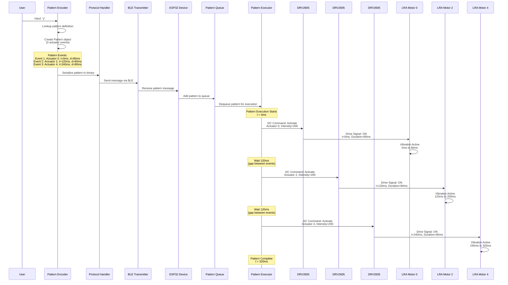

# Electrical Signals for Character 'Y': Sequence Diagram

## Pattern Definition

Character 'Y' uses a **complex pattern** with three actuators in sequence:
- **Actuator 0**: Starts at 0ms, duration 80ms
- **Actuator 2**: Starts at 120ms, duration 80ms  
- **Actuator 4**: Starts at 240ms, duration 80ms
- **Total duration**: 320ms

## Sequence Diagram: Electrical Signals



## Timeline View: Electrical Signals Over Time

```
Time (ms):    0    50   100  150  200  250  300  350
              |    |    |    |    |    |    |    |
Actuator 0:   ████████
              (0-80ms)
              
Actuator 1:   (idle)
              
Actuator 2:                    ████████
                                (120-200ms)
                                
Actuator 3:   (idle)

Actuator 4:                                    ████████
                                               (240-320ms)
                                               
Actuator 5-7: (idle)

Legend:
████ = Vibration active (electrical signal HIGH)
      = No signal (electrical signal LOW/idle)
```

## Detailed Signal Timing

### Event 1: Actuator 0 (0-80ms)

```
Time: 0ms
├─ Pattern Executor sends I2C command to DRV2605 #0
│  └─ Command: SET_MODE(REALTIME_PLAYBACK)
│  └─ Command: SET_ACTUATOR(0)
│  └─ Command: SET_WAVEFORM(amplitude=200, duration=80ms)
│
└─ DRV2605 #0 generates drive signal
   └─ Output: PWM signal to LRA Motor 0
      └─ Frequency: ~175Hz (resonance frequency)
      └─ Amplitude: Based on intensity (200/255)
      └─ Duration: 80ms
```

### Gap Period (80-120ms)

```
Time: 80-120ms
├─ Actuator 0: Signal goes LOW (motor stops)
├─ Actuator 2: Waiting (no signal)
└─ Pattern Executor: Counting down to next event (40ms wait)
```

### Event 2: Actuator 2 (120-200ms)

```
Time: 120ms
├─ Pattern Executor sends I2C command to DRV2605 #2
│  └─ Command: SET_MODE(REALTIME_PLAYBACK)
│  └─ Command: SET_ACTUATOR(2)
│  └─ Command: SET_WAVEFORM(amplitude=200, duration=80ms)
│
└─ DRV2605 #2 generates drive signal
   └─ Output: PWM signal to LRA Motor 2
      └─ Frequency: ~175Hz (resonance frequency)
      └─ Amplitude: Based on intensity (200/255)
      └─ Duration: 80ms
```

### Gap Period (200-240ms)

```
Time: 200-240ms
├─ Actuator 2: Signal goes LOW (motor stops)
├─ Actuator 4: Waiting (no signal)
└─ Pattern Executor: Counting down to next event (40ms wait)
```

### Event 3: Actuator 4 (240-320ms)

```
Time: 240ms
├─ Pattern Executor sends I2C command to DRV2605 #4
│  └─ Command: SET_MODE(REALTIME_PLAYBACK)
│  └─ Command: SET_ACTUATOR(4)
│  └─ Command: SET_WAVEFORM(amplitude=200, duration=80ms)
│
└─ DRV2605 #4 generates drive signal
   └─ Output: PWM signal to LRA Motor 4
      └─ Frequency: ~175Hz (resonance frequency)
      └─ Amplitude: Based on intensity (200/255)
      └─ Duration: 80ms
```

### Pattern Complete (320ms)

```
Time: 320ms
├─ Actuator 4: Signal goes LOW (motor stops)
└─ Pattern Executor: Pattern complete, ready for next pattern
```

## I2C Communication Details

### I2C Bus Signals

```
I2C Bus (SDA/SCL) - Shared by all 8 DRV2605 drivers

Time: 0ms
├─ START condition
├─ Address: 0x5A (DRV2605 #0 base address)
├─ Register: MODE (0x01)
├─ Data: 0x05 (REALTIME_PLAYBACK)
├─ Register: RTP_INPUT (0x04)
├─ Data: 0xC8 (200 = intensity)
├─ STOP condition
└─ Duration: ~2-5ms (I2C transaction)

Time: 120ms
├─ START condition
├─ Address: 0x5A + offset (DRV2605 #2 address)
├─ Register: MODE (0x01)
├─ Data: 0x05 (REALTIME_PLAYBACK)
├─ Register: RTP_INPUT (0x04)
├─ Data: 0xC8 (200 = intensity)
├─ STOP condition
└─ Duration: ~2-5ms (I2C transaction)

Time: 240ms
├─ START condition
├─ Address: 0x5A + offset (DRV2605 #4 address)
├─ Register: MODE (0x01)
├─ Data: 0x05 (REALTIME_PLAYBACK)
├─ Register: RTP_INPUT (0x04)
├─ Data: 0xC8 (200 = intensity)
├─ STOP condition
└─ Duration: ~2-5ms (I2C transaction)
```

## DRV2605 Drive Signal Details

### PWM Signal Characteristics

```
For each actuator activation:

PWM Signal (to LRA Motor):
├─ Frequency: ~175Hz (LRA resonance frequency)
├─ Duty Cycle: Variable (based on intensity)
│  └─ Intensity 200/255 ≈ 78% duty cycle
├─ Voltage: 1.8-3.6V (typical LRA operating voltage)
├─ Current: 30-80mA (typical LRA operating current)
└─ Waveform: Sine wave (for LRA resonance)

Signal Shape:
     Voltage
     ^
     |     ╱╲     ╱╲     ╱╲
     |    ╱  ╲   ╱  ╲   ╱  ╲
     |   ╱    ╲ ╱    ╲ ╱    ╲
     |  ╱      ╲      ╲      ╲
     |_╱________╲______╲______╲__> Time
     0ms        80ms   120ms  200ms
```

## Complete Signal Flow

### High-Level Flow

```
1. User Input: 'y'
   ↓
2. Pattern Encoder: Lookup pattern → 3 events
   ↓
3. Protocol Serialization: Pattern → Binary message
   ↓
4. BLE Transmission: Message → Device
   ↓
5. Pattern Queue: Add to execution queue
   ↓
6. Pattern Executor: Execute events at correct times
   ↓
7. I2C Commands: ESP32 → DRV2605 drivers
   ↓
8. Drive Signals: DRV2605 → LRA Motors
   ↓
9. Physical Vibration: Motors → Skin
```

### Low-Level Electrical Signals

```
ESP32 GPIO 21 (SDA) / GPIO 22 (SCL)
    ↓
I2C Bus (400kHz)
    ↓
DRV2605 Drivers (8×, shared bus, different addresses)
    ↓
PWM Output Pins (one per driver)
    ↓
LRA Motor Terminals
    ↓
Motor Vibration (mechanical output)
```

## Timing Precision

### Critical Timing Points

```
t=0ms:     Actuator 0 activation (must be precise)
t=80ms:    Actuator 0 deactivation
t=120ms:   Actuator 2 activation (40ms gap)
t=200ms:   Actuator 2 deactivation
t=240ms:   Actuator 4 activation (40ms gap)
t=320ms:   Actuator 4 deactivation (pattern complete)
```

### Timing Tolerance

- **Actuator activation**: ±1ms (hardware timer precision)
- **Gap duration**: ±2ms (acceptable for pattern recognition)
- **Total pattern**: ±5ms (acceptable for user perception)

## Summary

Character 'Y' produces a **three-phase sequential pattern**:
1. **Phase 1** (0-80ms): Actuator 0 vibrates
2. **Gap** (80-120ms): 40ms pause
3. **Phase 2** (120-200ms): Actuator 2 vibrates
4. **Gap** (200-240ms): 40ms pause
5. **Phase 3** (240-320ms): Actuator 4 vibrates
6. **Complete** (320ms): Pattern finished

**Total Duration**: 320ms  
**Actuators Used**: 0, 2, 4 (spatial encoding: left → center → right)  
**Pattern Type**: Sequential (temporal encoding: three pulses with gaps)

This creates a distinctive "moving" sensation across the forearm, helping users distinguish 'Y' from other letters.

