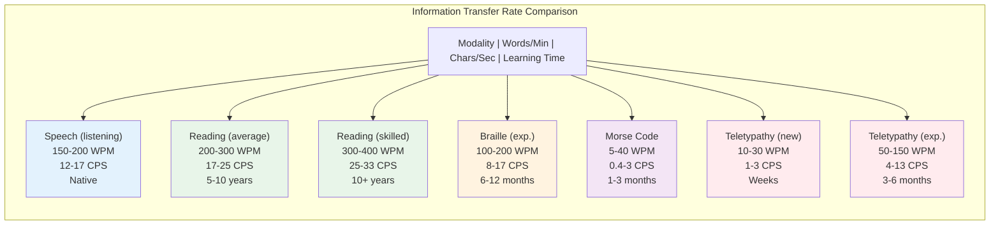
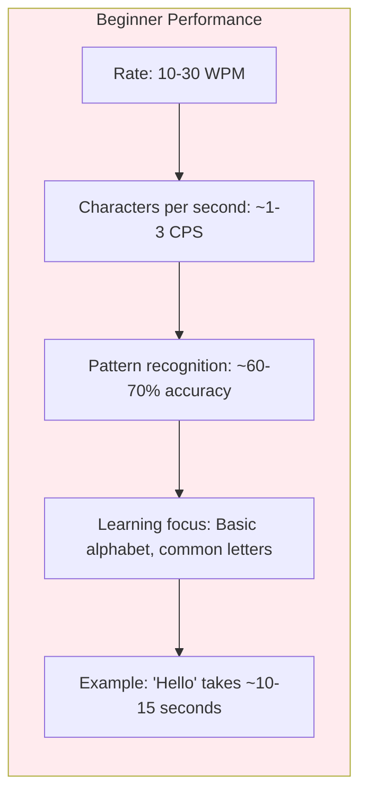
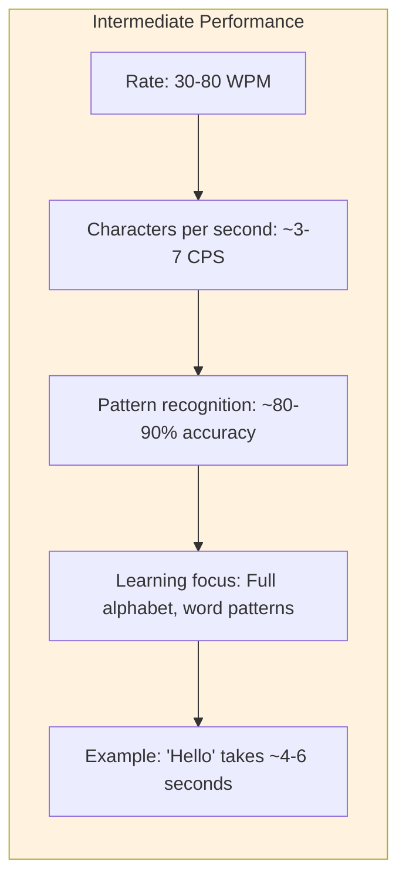
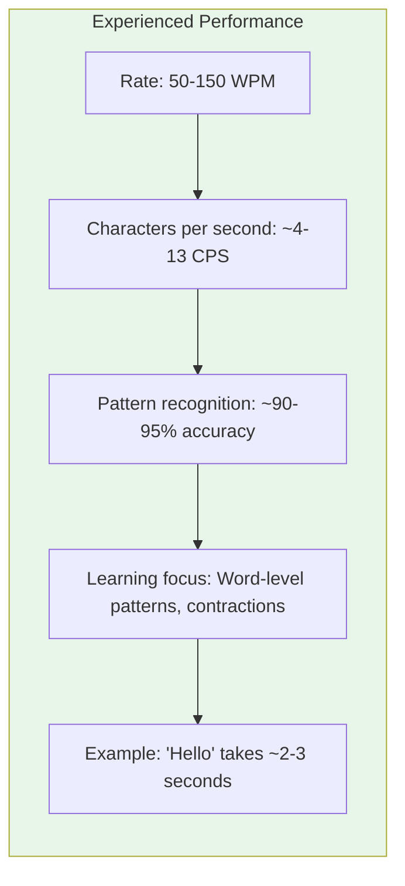
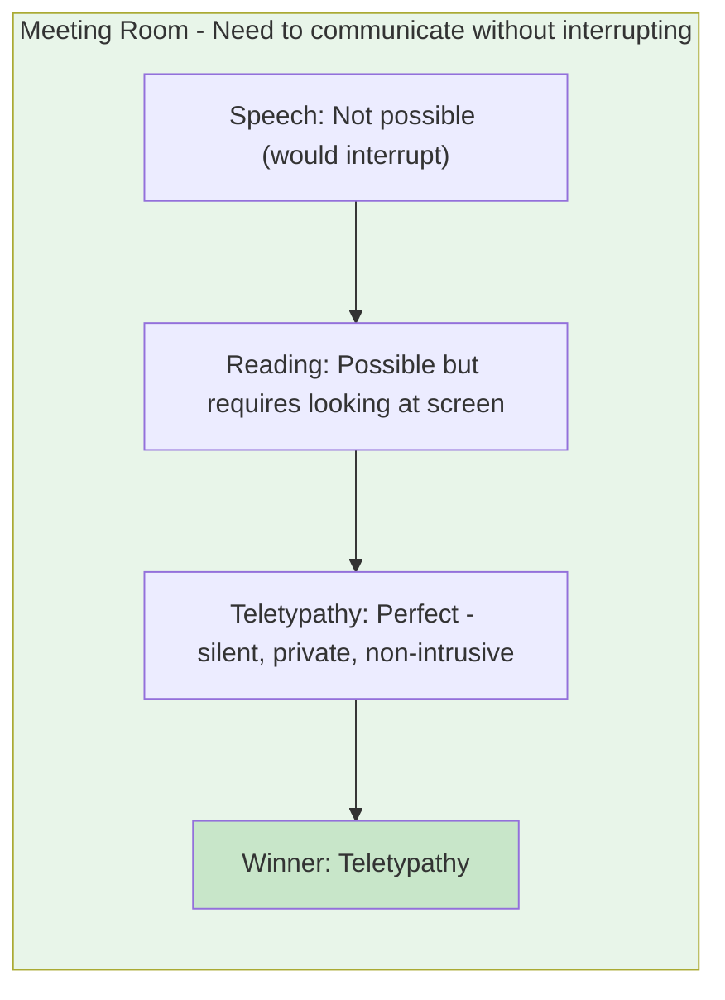
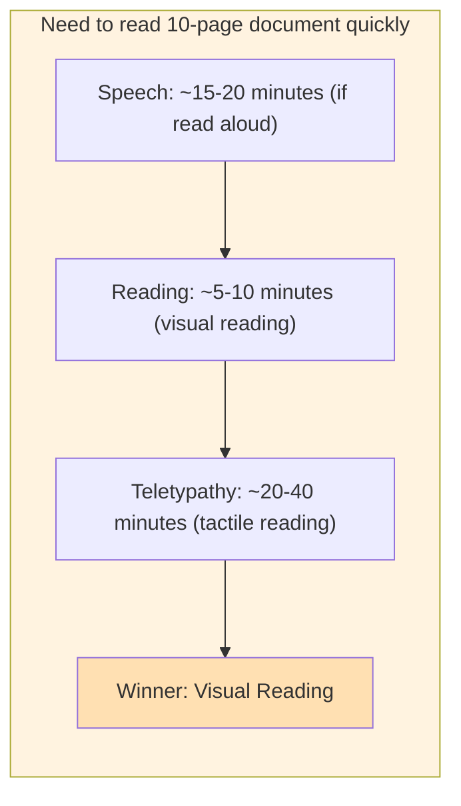
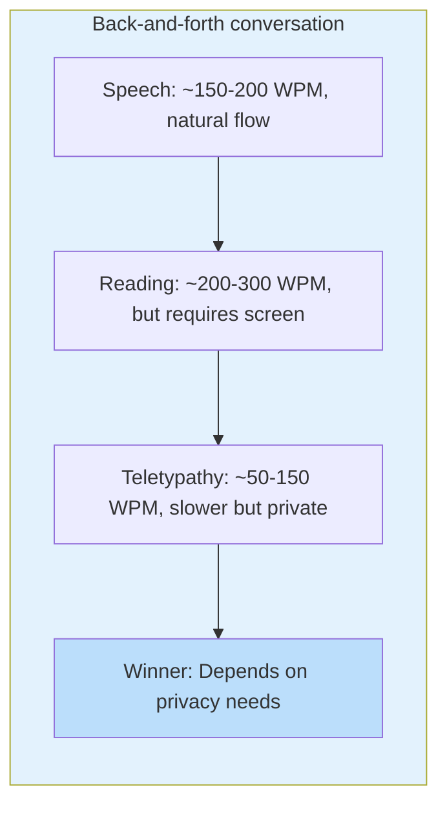
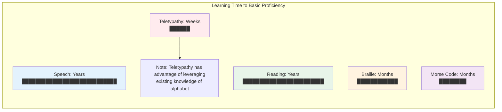

# Comprehension Rates: Teletypathy vs. Speech and Reading

## Overview

This document compares the information transfer rates and comprehension speeds of Teletypathy tactile communication with traditional modalities: audible speech and visual reading.

## Comparison Table

## Detailed Breakdown

### Audible Speech

#### Characteristics
- **Rate**: 150-200 words per minute (WPM) in normal conversation
- **Characters per second**: ~12-17 CPS (assuming 5 chars/word average)
- **Information density**: High (includes prosody, emotion, tone)
- **Learning**: Native language acquisition from birth

#### Advantages
- Natural, intuitive
- High information rate
- Includes emotional/prosodic information
- Multimodal (can combine with visual cues)

#### Limitations
- Requires attention (can't multitask easily)
- Not private (others can hear)
- Affected by noise
- Language-dependent

### Visual Reading

#### Average Reader
- **Rate**: 200-300 WPM
- **Characters per second**: ~17-25 CPS
- **Learning time**: 5-10 years of practice
- **Comprehension**: ~60-70% at this speed

#### Skilled Reader
- **Rate**: 300-400 WPM
- **Characters per second**: ~25-33 CPS
- **Learning time**: 10+ years of practice
- **Comprehension**: ~70-80% at this speed

#### Speed Reader
- **Rate**: 400-1000+ WPM
- **Characters per second**: ~33-83 CPS
- **Comprehension**: Often reduced (40-60%)
- **Technique**: Skimming, pattern recognition

#### Advantages
- Very high information rate
- Can re-read for comprehension
- Private (silent)
- Can skim/scan for information

#### Limitations
- Requires visual attention
- Can't multitask while reading
- Requires good lighting
- Language-dependent

### Tactile Communication Systems

#### Braille (Reference)
- **Rate**: 100-200 WPM (experienced users)
- **Characters per second**: ~8-17 CPS
- **Learning time**: 6-12 months for basic proficiency
- **Pattern**: 6-dot spatial encoding
- **Comprehension**: High (>95% with training)

#### Morse Code (Reference)
- **Rate**: 5-40 WPM typical
- **Characters per second**: ~0.4-3 CPS
- **Learning time**: 1-3 months for basic proficiency
- **Pattern**: Temporal encoding (dots/dashes)
- **Comprehension**: Requires timing sense

## Teletypathy Performance Estimates

### Theoretical Maximum Rate

Based on pattern design:
- **Pattern duration**: 100-300ms per character (average ~200ms)
- **Inter-pattern spacing**: 150ms minimum
- **Total per character**: ~250-450ms average
- **Characters per second**: ~2.2-4 CPS theoretical maximum
- **Words per minute**: ~27-48 WPM theoretical maximum

*Note: This assumes perfect pattern recognition and no processing delays*

### Realistic Performance Estimates

#### Beginner (Weeks 1-4)

#### Intermediate (Months 2-3)

#### Experienced (Months 4-6+)

### Factors Affecting Performance

#### Pattern Complexity
- **Simple patterns** (single actuator, single pulse): Faster recognition
- **Complex patterns** (multi-actuator, sequences): Slower recognition
- **Trade-off**: Simplicity vs. information density

#### Frequency Optimization
- **Common characters** (E, T, A): Shorter patterns = faster
- **Rare characters** (Z, Q, X): Longer patterns = slower
- **Net effect**: ~20-30% speed improvement with optimization

#### Word-Level Patterns
- **Common words** ("the", "and", "is"): Single pattern = much faster
- **Effect**: Could increase rate by 50-100% for common words
- **Requirement**: Additional learning/memory

#### User Factors
- **Attention**: Focus improves recognition
- **Fatigue**: Performance decreases over time
- **Practice**: Regular use improves speed
- **Individual differences**: Varies by person

## Realistic Comparison

### Speed Comparison (Experienced Users)

```mermaid
flowchart LR
    subgraph Comparison["Relative Speed Comparison<br/>(Percentages relative to speech 150-200 WPM)"]
        direction TB
        
        SpeechBar["Speech (listening): 100%<br/>████████████████████"]
        ReadingAvgBar["Reading (average): 120%<br/>████████████████████████"]
        ReadingSkillBar["Reading (skilled): 150%<br/>████████████████████████████"]
        BrailleBar["Braille (experienced): 80%<br/>████████████████"]
        TeleBar["Teletypathy (exp.): 50-75%<br/>██████████"]
        MorseBar["Morse Code: 10-20%<br/>██"]
        
        SpeechBar
        ReadingAvgBar
        ReadingSkillBar
        BrailleBar
        TeleBar
        MorseBar
    end
    
    style SpeechBar fill:#e3f2fd
    style ReadingAvgBar fill:#e8f5e9
    style ReadingSkillBar fill:#e8f5e9
    style BrailleBar fill:#fff3e0
    style TeleBar fill:#ffebee
    style MorseBar fill:#f3e5f5
```

### When Teletypathy Might Be Faster

#### Contexts Where Tactile Wins
1. **Noisy environments**: Can't hear speech
2. **Privacy required**: Silent communication
3. **Multitasking**: Can feel patterns while doing other tasks
4. **Visual overload**: Eyes busy with other tasks
5. **Accessibility**: For users with hearing/vision limitations

#### Contexts Where Speech/Reading Win
1. **High information rate needed**: Reading is faster
2. **Complex concepts**: Visual/spoken language more expressive
3. **Casual conversation**: Speech is more natural
4. **Learning new concepts**: Visual/spoken easier to understand

## Practical Implications

### Use Case Scenarios

#### Scenario 1: Silent Communication

#### Scenario 2: Reading Long Document

#### Scenario 3: Real-Time Chat

## Learning Curve Comparison

## Optimizations for Speed

### Pattern Optimizations
1. **Frequency-based encoding**: Shorter patterns for common letters
2. **Word-level patterns**: Common words as single patterns
3. **Contractions**: Abbreviations for common phrases
4. **Context-aware**: Adapt patterns based on context

### System Optimizations
1. **Reduced latency**: Faster pattern delivery
2. **Overlapping patterns**: Start next pattern before previous ends
3. **Predictive patterns**: Anticipate common sequences
4. **Adaptive timing**: Adjust speed to user's recognition rate

### Potential Performance with Optimizations
- **With word-level patterns**: +50-100% speed
- **With contractions**: +20-30% speed
- **With adaptive timing**: +10-20% speed
- **Combined**: Could reach 100-200 WPM (similar to Braille)

## Conclusion

### Realistic Expectations

**For Average User (After 3-6 months)**:
- **Rate**: 50-100 WPM
- **Comparison**: ~30-50% of speech speed, ~25-50% of reading speed
- **Advantage**: Private, silent, multitaskable

**For Experienced User (After 6+ months)**:
- **Rate**: 100-150 WPM
- **Comparison**: ~50-75% of speech speed, ~33-50% of reading speed
- **Advantage**: Comparable to Braille, with privacy benefits

**Key Insight**: Teletypathy won't replace speech or reading for speed, but offers unique advantages in privacy, silence, and multitasking that make it valuable for specific use cases.

## References

### Reading Speed Research
1. Carver, R. P. (1990). *Reading Rate: A Review of Research and Theory*. Academic Press.
2. Rayner, K., Schotter, E. R., Masson, M. E., Potter, M. C., & Treiman, R. (2016). So much to read, so little time: How do we read, and can speed reading help? *Psychological Science in the Public Interest*, 17(1), 4-34.

### Speech Rate Research
3. Crystal, D., & House, A. S. (1990). Articulation rate and the duration of syllables and stress groups in connected speech. *Journal of the Acoustical Society of America*, 88(1), 101-112.
4. Jacewicz, E., Fox, R. A., & Wei, L. (2010). Between-speaker and within-speaker variation in speech tempo of American English. *Journal of the Acoustical Society of America*, 128(2), 839-850.

### Tactile Communication Research
5. See [Language Interfaces Research](../research/language_interfaces.md)
6. See [Linguistics Research](../research/linguistics.md)
7. See [Sensory Augmentation Research](../research/sensory_augmentation.md)
