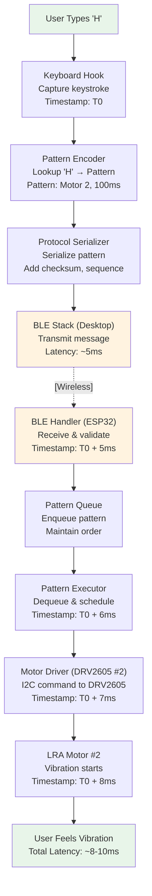
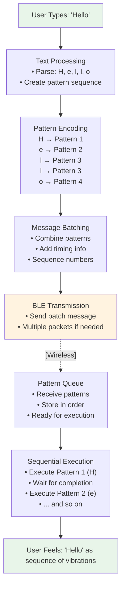

# Data Flow Diagrams

## End-to-End Data Flow

```mermaid
flowchart TD
    User["User Types 'H'"] --> KH["Keyboard Hook<br/>Capture keystroke<br/>Timestamp: T0"]
    KH --> PE["Pattern Encoder<br/>Lookup 'H' → Pattern<br/>Pattern: Motor 2, 100ms"]
    PE --> PS["Protocol Serializer<br/>Serialize pattern<br/>Add checksum, sequence"]
    PS --> BLE1["BLE Stack (Desktop)<br/>Transmit message<br/>Latency: ~5ms"]
    BLE1 -.->|"[Wireless]"| BLE2["BLE Handler (ESP32)<br/>Receive & validate<br/>Timestamp: T0 + 5ms"]
    BLE2 --> PQ["Pattern Queue<br/>Enqueue pattern<br/>Maintain order"]
    PQ --> PEX["Pattern Executor<br/>Dequeue & schedule<br/>Timestamp: T0 + 6ms"]
    PEX --> MD["Motor Driver (DRV2605 #2)<br/>I2C command to DRV2605<br/>Timestamp: T0 + 7ms"]
    MD --> LM["LRA Motor #2<br/>Vibration starts<br/>Timestamp: T0 + 8ms"]
    LM --> User2["User Feels Vibration<br/>Total Latency: ~8-10ms"]
    
    style User fill:#e8f5e9
    style User2 fill:#e8f5e9
    style BLE1 fill:#fff3e0
    style BLE2 fill:#fff3e0
```

## Message Flow for Text

```mermaid
flowchart TD
    Input["User Types: 'Hello'"] --> TP["Text Processing<br/>• Parse: H, e, l, l, o<br/>• Create pattern sequence"]
    TP --> PE["Pattern Encoding<br/>H → Pattern 1<br/>e → Pattern 2<br/>l → Pattern 3<br/>l → Pattern 3<br/>o → Pattern 4"]
    PE --> MB["Message Batching<br/>• Combine patterns<br/>• Add timing info<br/>• Sequence numbers"]
    MB --> BLE1["BLE Transmission<br/>• Send batch message<br/>• Multiple packets if needed"]
    BLE1 -.->|"[Wireless]"| PQ["Pattern Queue<br/>• Receive patterns<br/>• Store in order<br/>• Ready for execution"]
    PQ --> SE["Sequential Execution<br/>• Execute Pattern 1 (H)<br/>• Wait for completion<br/>• Execute Pattern 2 (e)<br/>• ... and so on"]
    SE --> User["User Feels: 'Hello' as sequence of vibrations"]
    
    style Input fill:#e8f5e9
    style User fill:#e8f5e9
    style BLE1 fill:#fff3e0
```

## Pattern Execution Timeline

```mermaid
gantt
    title Pattern Execution Timeline
    dateFormat X
    axisFormat %Lms
    
    section Keystroke to Transmission
    User types 'H'           :0, 1
    Pattern encoded          :1, 1
    Message serialized       :2, 1
    BLE transmission starts  :3, 5
    
    section Device Processing
    Message received         :8, 1
    Pattern queued           :9, 1
    Pattern execution starts :10, 1
    
    section Vibration
    Motor 2 activates        :10, 100
    Motor 2 stops           :110, 1
    User feels vibration     :110, 1
```

```mermaid
flowchart LR
    T0["T0: User types 'H'"] --> T1["T+1ms: Pattern encoded"]
    T1 --> T2["T+2ms: Message serialized"]
    T2 --> T3["T+3ms: BLE transmission starts"]
    T3 --> T8["T+8ms: Message received"]
    T8 --> T9["T+9ms: Pattern queued"]
    T9 --> T10["T+10ms: Execution starts"]
    T10 --> T110["T+110ms: User feels vibration"]
    
    Total["Total: ~110ms from keystroke to feeling<br/>(Target: <10ms latency + pattern duration)"]
    T110 --> Total
    
    style T0 fill:#e8f5e9
    style T110 fill:#e8f5e9
    style Total fill:#fff3e0
```
