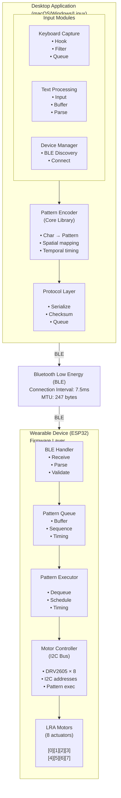
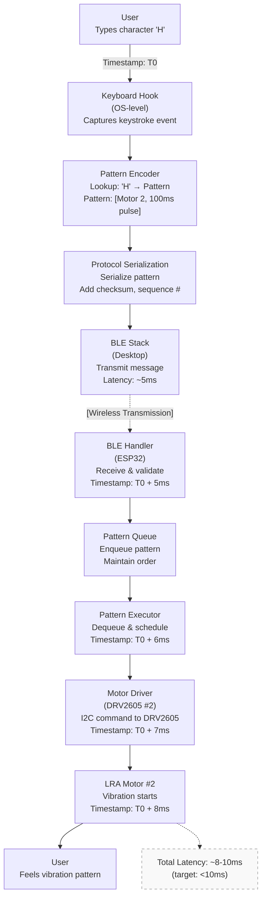
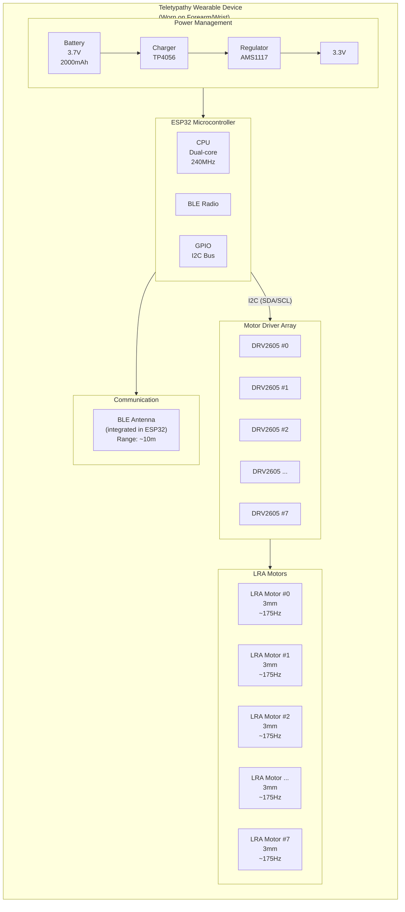
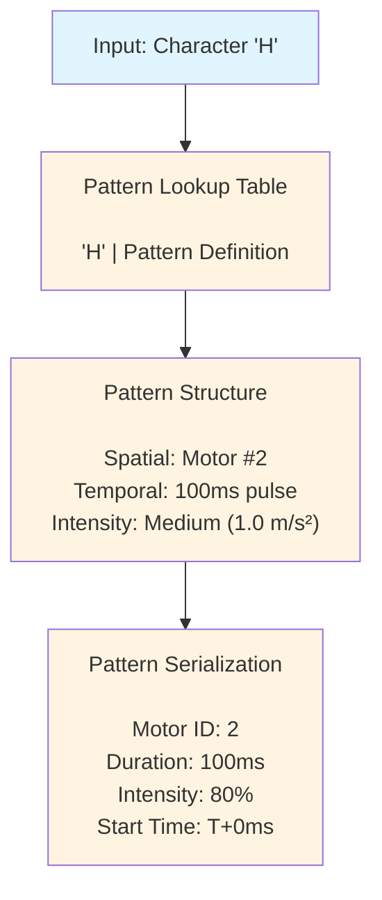
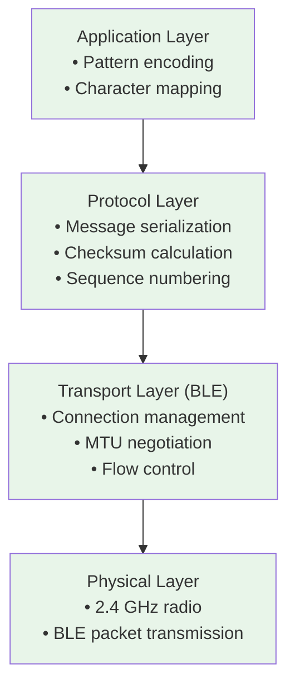

# Technical System Architecture

## Complete System Architecture

```mermaid
flowchart TB
    subgraph Desktop["Desktop Application<br/>(macOS/Windows/Linux)"]
        direction TB
        subgraph Input["Input Modules"]
            direction LR
            KC["Keyboard Capture<br/>• Hook<br/>• Filter<br/>• Queue"]
            TP["Text Processing<br/>• Input<br/>• Buffer<br/>• Parse"]
            DM["Device Manager<br/>• BLE Discovery<br/>• Connect"]
        end
        
        PE["Pattern Encoder<br/>(Core Library)<br/><br/>• Char → Pattern<br/>• Spatial mapping<br/>• Temporal timing"]
        
        PL["Protocol Layer<br/><br/>• Serialize<br/>• Checksum<br/>• Queue"]
        
        Input --> PE
        PE --> PL
    end
    
    BLE["Bluetooth Low Energy (BLE)<br/>Connection Interval: 7.5ms<br/>MTU: 247 bytes"]
    
    subgraph Wearable["Wearable Device (ESP32)<br/>Firmware Layer"]
        direction TB
        BH["BLE Handler<br/>• Receive<br/>• Parse<br/>• Validate"]
        PQ["Pattern Queue<br/>• Buffer<br/>• Sequence<br/>• Timing"]
        PEX["Pattern Executor<br/><br/>• Dequeue<br/>• Schedule<br/>• Timing"]
        MC["Motor Controller<br/>(I2C Bus)<br/><br/>• DRV2605 × 8<br/>• I2C addresses<br/>• Pattern exec"]
        LRAM["LRA Motors<br/>(8 actuators)<br/><br/>[0][1][2][3]<br/>[4][5][6][7]"]
        
        BH --> PQ
        PQ --> PEX
        PEX --> MC
        MC --> LRAM
    end
    
    Desktop -->|BLE| BLE
    BLE -->|BLE| Wearable
```

## Data Flow Diagram

```mermaid
flowchart LR
    User1["User Types 'H'"] --> KC["Keyboard Capture"]
    KC --> PE["Pattern Encoder"]
    PE --> Protocol["Protocol"]
    Protocol --> BLE1["BLE"]
    
    BLE2["BLE"] --> Queue["Queue"]
    Queue --> Executor["Executor"]
    Executor --> Drivers["Motor Drivers"]
    Drivers --> Motors["LRA Motors"]
    Motors --> User2["User Feels Pattern"]
    
    BLE1 -.->|Wireless| BLE2
```

### Detailed Data Flow

```mermaid
flowchart TD
    User1["User<br/>Types character 'H'"] -->|"Timestamp: T0"| KH["Keyboard Hook<br/>(OS-level)<br/>Captures keystroke event"]
    KH --> PE["Pattern Encoder<br/>Lookup: 'H' → Pattern<br/>Pattern: [Motor 2, 100ms pulse]"]
    PE --> PS["Protocol Serialization<br/>Serialize pattern<br/>Add checksum, sequence #"]
    PS --> BLE1["BLE Stack<br/>(Desktop)<br/>Transmit message<br/>Latency: ~5ms"]
    BLE1 -.->|"[Wireless Transmission]"| BLE2["BLE Handler<br/>(ESP32)<br/>Receive & validate<br/>Timestamp: T0 + 5ms"]
    BLE2 --> PQ["Pattern Queue<br/>Enqueue pattern<br/>Maintain order"]
    PQ --> PEX["Pattern Executor<br/>Dequeue & schedule<br/>Timestamp: T0 + 6ms"]
    PEX --> MD["Motor Driver<br/>(DRV2605 #2)<br/>I2C command to DRV2605<br/>Timestamp: T0 + 7ms"]
    MD --> LM["LRA Motor #2<br/>Vibration starts<br/>Timestamp: T0 + 8ms"]
    LM --> User2["User<br/>Feels vibration pattern"]
    
    Note["Total Latency: ~8-10ms<br/>(target: <10ms)"]
    LM -.-> Note
    
    style Note fill:#f9f9f9,stroke:#999,stroke-dasharray: 5 5
```

## Hardware Block Diagram

```mermaid
flowchart TB
    subgraph Device["Teletypathy Wearable Device<br/>(Worn on Forearm/Wrist)"]
        direction TB
        
        subgraph Power["Power Management"]
            direction LR
            Battery["Battery<br/>3.7V<br/>2000mAh"] --> Charger["Charger<br/>TP4056"]
            Charger --> Regulator["Regulator<br/>AMS1117"]
            Regulator --> V33["3.3V"]
        end
        
        subgraph ESP32["ESP32 Microcontroller"]
            direction LR
            CPU["CPU<br/>Dual-core<br/>240MHz"]
            BLERadio["BLE Radio"]
            GPIO["GPIO<br/>I2C Bus"]
        end
        
        subgraph MotorDrivers["Motor Driver Array"]
            direction LR
            DRV0["DRV2605 #0"]
            DRV1["DRV2605 #1"]
            DRV2["DRV2605 #2"]
            DRV3["DRV2605 ..."]
            DRV7["DRV2605 #7"]
        end
        
        subgraph LRAMotors["LRA Motors"]
            direction LR
            LRA0["LRA Motor #0<br/>3mm<br/>~175Hz"]
            LRA1["LRA Motor #1<br/>3mm<br/>~175Hz"]
            LRA2["LRA Motor #2<br/>3mm<br/>~175Hz"]
            LRA3["LRA Motor ...<br/>3mm<br/>~175Hz"]
            LRA7["LRA Motor #7<br/>3mm<br/>~175Hz"]
        end
        
        subgraph Comm["Communication"]
            BLEAnt["BLE Antenna<br/>(integrated in ESP32)<br/>Range: ~10m"]
        end
        
        Power --> ESP32
        ESP32 -->|"I2C (SDA/SCL)"| MotorDrivers
        MotorDrivers --> LRAMotors
        ESP32 --> Comm
    end
```

## Encoding System Architecture

```mermaid
flowchart TD
    Input["Input: Character 'H'"] --> PLT["Pattern Lookup Table<br/><br/>'H' | Pattern Definition"]
    PLT --> PS["Pattern Structure<br/><br/>Spatial: Motor #2<br/>Temporal: 100ms pulse<br/>Intensity: Medium (1.0 m/s²)"]
    PS --> PSer["Pattern Serialization<br/><br/>Motor ID: 2<br/>Duration: 100ms<br/>Intensity: 80%<br/>Start Time: T+0ms"]
    
    style Input fill:#e1f5ff
    style PLT fill:#fff4e1
    style PS fill:#fff4e1
    style PSer fill:#fff4e1
```

## Protocol Stack

```mermaid
flowchart TD
    App["Application Layer<br/>• Pattern encoding<br/>• Character mapping"]
    Protocol["Protocol Layer<br/>• Message serialization<br/>• Checksum calculation<br/>• Sequence numbering"]
    Transport["Transport Layer (BLE)<br/>• Connection management<br/>• MTU negotiation<br/>• Flow control"]
    Physical["Physical Layer<br/>• 2.4 GHz radio<br/>• BLE packet transmission"]
    
    App --> Protocol
    Protocol --> Transport
    Transport --> Physical
    
    style App fill:#e8f5e9
    style Protocol fill:#e8f5e9
    style Transport fill:#e8f5e9
    style Physical fill:#e8f5e9
```
