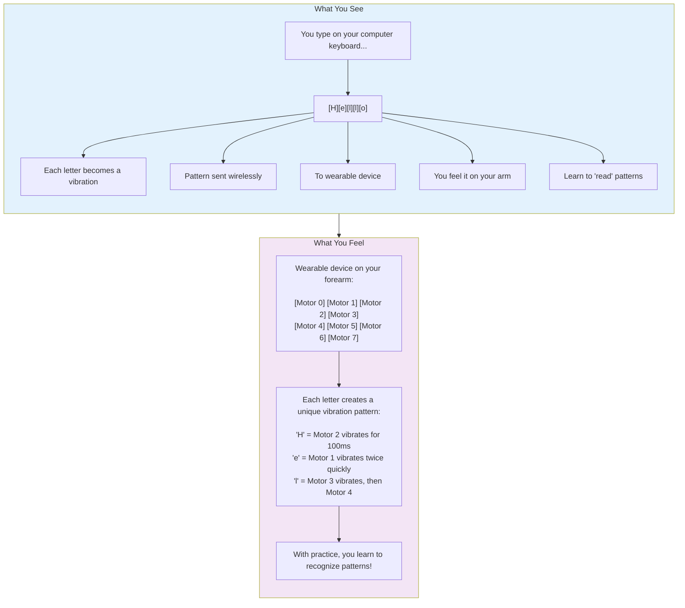
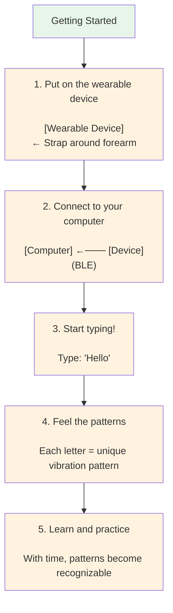
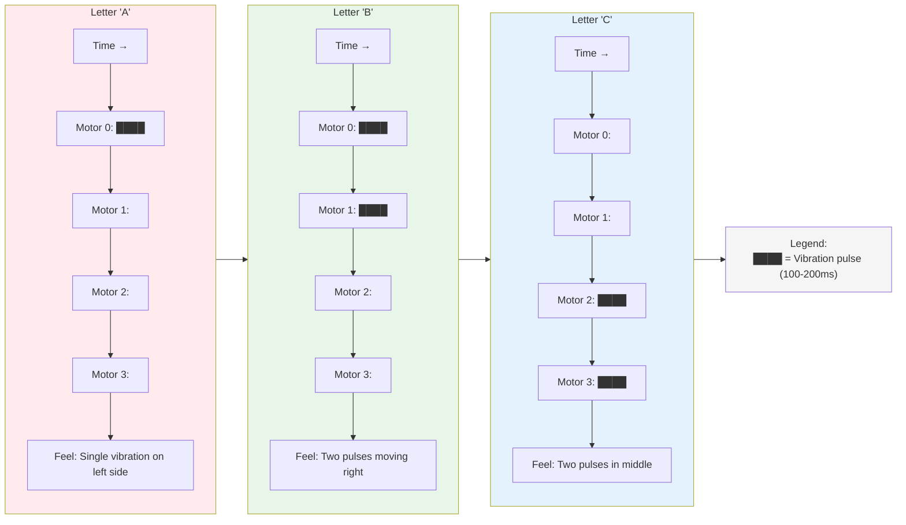
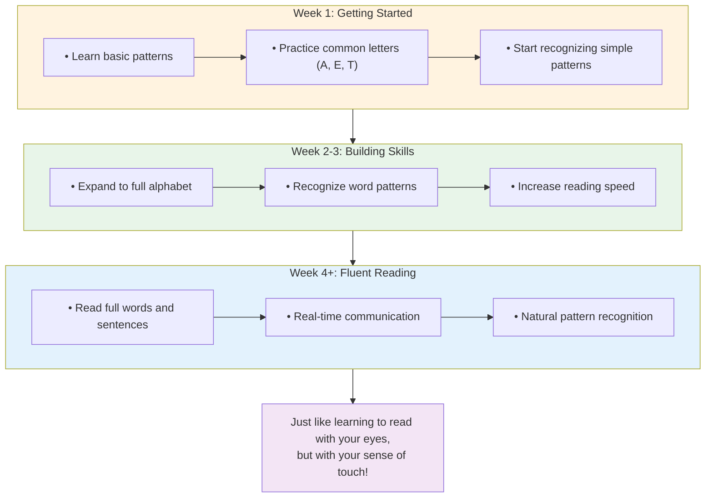
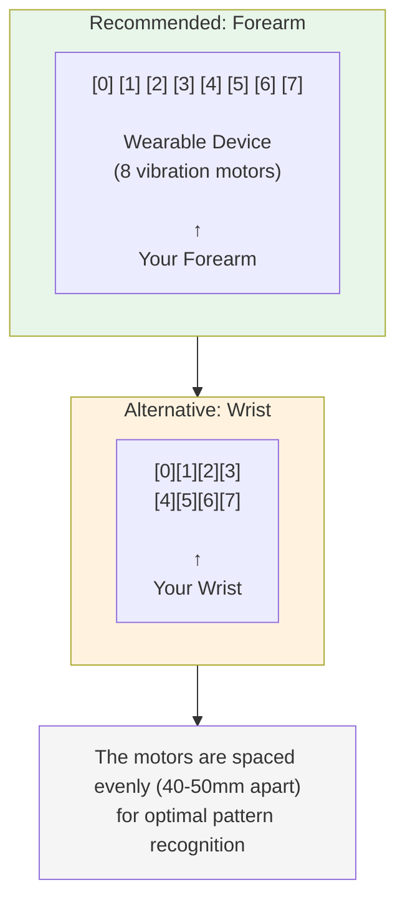

# User Experience Diagrams

## How Teletypathy Works (Simple Explanation)

```mermaid
flowchart TD
    subgraph See["What You See"]
        direction TB
        Type["You type on your computer keyboard..."]
        Letters["[H][e][l][l][o]"]
        Type --> Letters
        
        Letters --> V1["Each letter becomes a vibration"]
        Letters --> V2["Pattern sent wirelessly"]
        Letters --> V3["To wearable device"]
        Letters --> V4["You feel it on your arm"]
        Letters --> V5["Learn to 'read' patterns"]
    end
    
    subgraph Feel["What You Feel"]
        direction TB
        Device["Wearable device on your forearm:<br/><br/>[Motor 0] [Motor 1] [Motor 2] [Motor 3]<br/>[Motor 4] [Motor 5] [Motor 6] [Motor 7]"]
        
        Patterns["Each letter creates a unique vibration pattern:<br/><br/>'H' = Motor 2 vibrates for 100ms<br/>'e' = Motor 1 vibrates twice quickly<br/>'l' = Motor 3 vibrates, then Motor 4"]
        
        Learn["With practice, you learn to recognize patterns!"]
        
        Device --> Patterns --> Learn
    end
    
    See --> Feel
    
    style See fill:#e3f2fd
    style Feel fill:#f3e5f5
```

## User Journey

```mermaid
flowchart TD
    Start["Getting Started"]
    
    Step1["1. Put on the wearable device<br/><br/>[Wearable Device]<br/>← Strap around forearm"]
    Step2["2. Connect to your computer<br/><br/>[Computer] ←─── [Device]<br/>(BLE)"]
    Step3["3. Start typing!<br/><br/>Type: 'Hello'"]
    Step4["4. Feel the patterns<br/><br/>Each letter = unique vibration pattern"]
    Step5["5. Learn and practice<br/><br/>With time, patterns become recognizable"]
    
    Start --> Step1 --> Step2 --> Step3 --> Step4 --> Step5
    
    style Start fill:#e8f5e9
    style Step1 fill:#fff3e0
    style Step2 fill:#fff3e0
    style Step3 fill:#fff3e0
    style Step4 fill:#fff3e0
    style Step5 fill:#fff3e0
```

## What It Feels Like

```mermaid
flowchart LR
    subgraph LetterA["Letter 'A'"]
        direction TB
        ATime["Time →"]
        AM0["Motor 0: ████"]
        AM1["Motor 1:"]
        AM2["Motor 2:"]
        AM3["Motor 3:"]
        AFeel["Feel: Single vibration on left side"]
        
        ATime --> AM0
        AM0 --> AM1 --> AM2 --> AM3 --> AFeel
    end
    
    subgraph LetterB["Letter 'B'"]
        direction TB
        BTime["Time →"]
        BM0["Motor 0: ████"]
        BM1["Motor 1:      ████"]
        BM2["Motor 2:"]
        BM3["Motor 3:"]
        BFeel["Feel: Two pulses moving right"]
        
        BTime --> BM0
        BM0 --> BM1 --> BM2 --> BM3 --> BFeel
    end
    
    subgraph LetterC["Letter 'C'"]
        direction TB
        CTime["Time →"]
        CM0["Motor 0:"]
        CM1["Motor 1:"]
        CM2["Motor 2: ████"]
        CM3["Motor 3:      ████"]
        CFeel["Feel: Two pulses in middle"]
        
        CTime --> CM0
        CM0 --> CM1 --> CM2 --> CM3 --> CFeel
    end
    
    Legend["Legend:<br/>████ = Vibration pulse (100-200ms)"]
    
    LetterA --> LetterB --> LetterC
    LetterC --> Legend
    
    style LetterA fill:#ffebee
    style LetterB fill:#e8f5e9
    style LetterC fill:#e3f2fd
    style Legend fill:#f5f5f5
```

## Learning Progression

```mermaid
flowchart TD
    subgraph Week1["Week 1: Getting Started"]
        W1A["• Learn basic patterns"]
        W1B["• Practice common letters (A, E, T)"]
        W1C["• Start recognizing simple patterns"]
        W1A --> W1B --> W1C
    end
    
    subgraph Week23["Week 2-3: Building Skills"]
        W23A["• Expand to full alphabet"]
        W23B["• Recognize word patterns"]
        W23C["• Increase reading speed"]
        W23A --> W23B --> W23C
    end
    
    subgraph Week4["Week 4+: Fluent Reading"]
        W4A["• Read full words and sentences"]
        W4B["• Real-time communication"]
        W4C["• Natural pattern recognition"]
        W4A --> W4B --> W4C
    end
    
    Insight["Just like learning to read with your eyes,<br/>but with your sense of touch!"]
    
    Week1 --> Week23 --> Week4 --> Insight
    
    style Week1 fill:#fff3e0
    style Week23 fill:#e8f5e9
    style Week4 fill:#e3f2fd
    style Insight fill:#f3e5f5
```

## Use Cases

```mermaid
flowchart TD
    subgraph Silent["📱 Silent Communication"]
        S1["• Meetings without interrupting"]
        S2["• Public spaces"]
        S3["• Private conversations"]
        S1 --> S2 --> S3
    end
    
    subgraph Gaming["🎮 Gaming & Applications"]
        G1["• Tactile feedback for games"]
        G2["• Accessibility features"]
        G3["• Immersive experiences"]
        G1 --> G2 --> G3
    end
    
    subgraph Notif["🔔 Notifications"]
        N1["• Important alerts"]
        N2["• Status updates"]
        N3["• Custom notifications"]
        N1 --> N2 --> N3
    end
    
    subgraph Learning["🧠 Learning & Research"]
        L1["• Sensory augmentation research"]
        L2["• Human-computer interaction"]
        L3["• Communication studies"]
        L1 --> L2 --> L3
    end
    
    Silent
    Gaming
    Notif
    Learning
    
    style Silent fill:#e3f2fd
    style Gaming fill:#f3e5f5
    style Notif fill:#fff3e0
    style Learning fill:#e8f5e9
```

## Device Placement

```mermaid
flowchart TD
    subgraph Recommended["Recommended: Forearm"]
        direction LR
        Forearm["[0] [1] [2] [3] [4] [5] [6] [7]<br/><br/>Wearable Device<br/>(8 vibration motors)<br/><br/>↑<br/>Your Forearm"]
    end
    
    subgraph Alternative["Alternative: Wrist"]
        direction LR
        Wrist["[0][1][2][3]<br/>[4][5][6][7]<br/><br/>↑<br/>Your Wrist"]
    end
    
    Note["The motors are spaced evenly (40-50mm apart)<br/>for optimal pattern recognition"]
    
    Recommended --> Alternative --> Note
    
    style Recommended fill:#e8f5e9
    style Alternative fill:#fff3e0
    style Note fill:#f5f5f5
```
